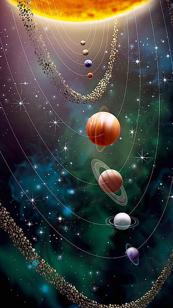

# 3D Slider Window

This project is a 3D slider window created using HTML and CSS only. It leverages the CSS `perspective` property to create a 3D effect, making the images appear to rotate in a 3-dimensional space.

## Features

- **3D Rotation**: The slider rotates images in a 3D space, giving a dynamic and engaging visual effect.
- **Pure CSS**: No JavaScript is used in this project. The 3D effect and animation are achieved solely through CSS.
- **Responsive Design**: The slider adapts to different screen sizes, making it suitable for various devices.

## Demo


## Usage

To use the 3D slider window, follow these steps:

1. **Clone the repository**:
    ```bash
    git clone https://github.com/yourusername/3d-slider-window.git
    ```
2. **Navigate to the project directory**:
    ```bash
    cd 3d-slider-window
    ```
3. **Open the `index.html` file in your browser** to see the 3D slider in action.

## Structure

The project contains the following key files:

- `index.html`: The main HTML file that contains the structure of the slider.
- `styles.css`: The CSS file that contains all the styles and animations for the slider.
- `images/`: A directory containing the images used in the slider.

## HTML

The HTML file contains the structure for the slider. Each image is wrapped in a `div` with the class `item`, and the `--position` custom property is used to determine the position of each image in the slider.

```html
<!DOCTYPE html>
<html lang="en">
<head>
    <meta charset="UTF-8">
    <meta name="viewport" content="width=device-width, initial-scale=1.0">
    <title>3D Slider Action</title>
    <link rel="stylesheet" href="styles.css">
</head>
<body>
    <div class="banner">
        <div class="slider" style="--quantity: 10">
            <div class="item" style="--position: 1">
                
            </div>
            <div class="item" style="--position: 2">
                
            </div>
            <!-- Additional images here -->
        </div>
    </div>
</body>
</html>
```
## CSS
The CSS file contains the styles and animations for the slider. The perspective property is used to create the 3D effect, and the rotateY transformation is used to rotate the images.

``` css
.banner {
    width: 100%;
    height: 100vh;
    text-align: center;
    overflow: hidden;
    position: relative;
}

.banner .slider {
    position: absolute;
    width: 200px;
    height: 250px;
    top: 10%;
    left: calc(50% - 100px);
    transform-style: preserve-3d;
    transform: perspective(1000px);
    animation: autoRun 20s linear infinite;
}

@keyframes autoRun {
    from {
        transform: perspective(1000px) rotateY(0deg);
    }
    to {
        transform: perspective(1000px) rotateY(360deg);
    }
}

.banner .slider .item {
    position: absolute;
    inset: 0 0 0 0;
    transform: rotateY(calc((var(--position) - 1) * (360deg / var(--quantity)))) translateZ(550px);
}

.banner .slider .item img {
    width: 100%;
    height: 100%;
    object-fit: cover;
}
```

## Customization
You can customize the slider by adjusting the following properties:

--quantity: The number of images in the slider. Update this value to match the number of images you have.
translateZ(550px): The distance of the images from the center of the slider. Adjust this value to change the depth effect.
animation: autoRun 20s linear infinite: The duration and timing of the rotation animation. Modify the 20s value to speed up or slow down the rotation.
